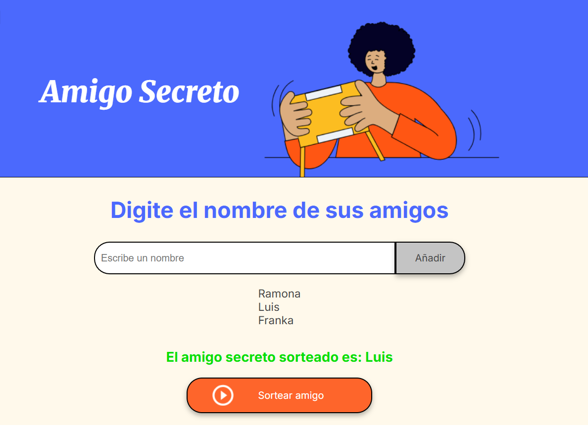

<em> # 🎁 Alura Challenge: Amigo Secreto </em>

Aplicación web sencilla para organizar un sorteo de "Amigo Secreto". Los usuarios pueden agregar nombres a una lista y sortear aleatoriamente un nombre como resultado.

## 🖼 Vista previa


## 🔨 Funcionalidades
- 📌 Agregar nombres a la lista.
- ✅ Validar que el campo no esté vacío.
- 📋 Mostrar los nombres ingresados en una lista.
- 🎲 Realizar un sorteo aleatorio y mostrar el resultado.

## 🛠 Instalación y uso
1. **Clonar el repositorio**  
   ```sh
   git clone https://github.com/kamimefis/secret-friend.git
   cd amigo-secreto 
2. **Abrir el archivo** `index.html` en tu navegador.

## 🚀 Prueba el proyecto en el siguiente enlace:
https://kamimefis.github.io/secret-friend/
